# UAE Beverage Sales Analysis

An end to end analysis of a UAE beverage sales dataset in R, covering data cleaning, exploratory analysis, time trend analysis, machine learning (clustering, classification, and forecasting), and anomaly detection.

The dataset was gathered from Kaggle: [Sales Dataset UAE Beverages](https://www.kaggle.com/datasets/ajitjha01/sales-dataset-uae-beverages), by Ajit Jha.

## 📁 Project Structure

```
📁
├── 📁 data
│   ├── 📊 clean_sales.csv
│   ├── 📄 clean_sales.rds
│   └── 📊 sales.csv
├── 📁 outputs
│   └── 📁 plots
├── 📁 scripts
│   ├── 📄 00_setup.R
│   ├── 📄 01_load_clean.R
│   ├── 📄 02_eda_overview.R
│   ├── 📄 03_modelling.R
│   └── 📄 04_anomaly_detection.R
├── ⚖️ LICENSE
└── 📘 README.md
```
> Generated using [Tree Printer](https://github.com/AmirmasoudCS/Tree-Printer.git).

To reproduce the analysis, run the scripts in `scripts/` in numeric order. Each script sources `00_setup.R` and reads the cleaned data from `data/clean_sales.rds`.

## 🔎 About the Dataset

The dataset contains beverage sales transactions from stores across the UAE, with 13 original columns: `Sale_Id`, `Category`, `Price`, `Quantity`, `Sales`, `Discount_%`, `Net_Sales`, `Date`, `Country`, `City`, `Store_Type`, `Gender`, and `Rating`. Cleaning added `Year`, `Month`, `Year_Month`, and `Discount_Amount` for the time based analysis.

The data spans seven categories (Arabic coffee, Arabic tea, Camel milk, Juice, Laban, Masala chai, Soft drinks), seven UAE cities, five store types (Hypermarket, Supermarket, Convenience Store, Online, Cafe), and roughly six years of transactions from 2020 to 2026.

## ❓ How the Analysis Was Approached

The guiding principle throughout this project was to test every variable in the dataset rather than only report the charts that looked interesting. Several variables (Quantity, Discount_%, Rating, City, Store_Type, Gender) turned out to show little to no meaningful pattern, and that is treated as a real finding, not a gap. Two variables, Category and Price, along with the time dimension, are where almost all of the genuine structure in this dataset lives. The sections below follow that story.

## 📊 Key Findings and Charts

### Category and Price drive the business

<div align="center">
  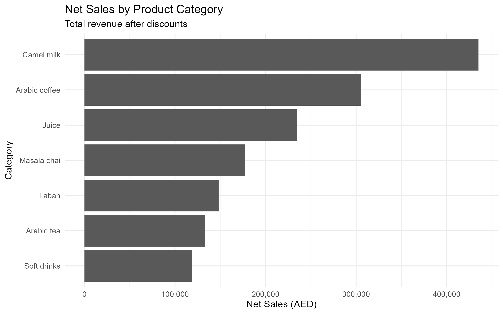
  <p><em>Total net revenue by product category, ranked highest to lowest.</em></p>
</div>

Camel milk and Arabic coffee generate substantially more revenue than the other five categories, despite not selling the highest volume. This is the single strongest pattern in the dataset. Code: [`scripts/02_eda_overview.R`](scripts/02_eda_overview.R), section 6.

</br>
<div align="center">
  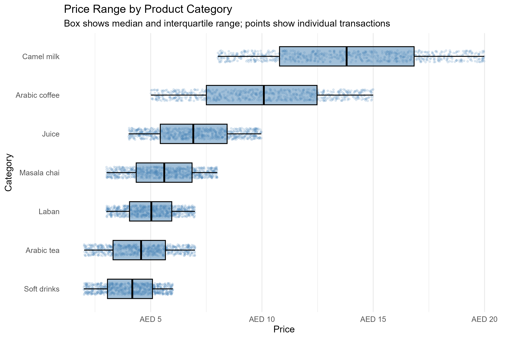
  <p><em>Price distribution per category, with individual transactions shown as points beneath each box.</em></p>
</div>

Each category occupies a distinct but fairly flat price range rather than clustering around one typical price. Camel milk (roughly AED 8 to 20) and Arabic coffee (roughly AED 4 to 15) sit well above the other five categories, whose boxes mostly overlap in the AED 2 to 8 range. This is the chart that first suggested a two tier price structure, which later got confirmed formally through clustering. Code: [`scripts/02_eda_overview.R`](scripts/02_eda_overview.R), section 10.

</br>
<div align="center">
  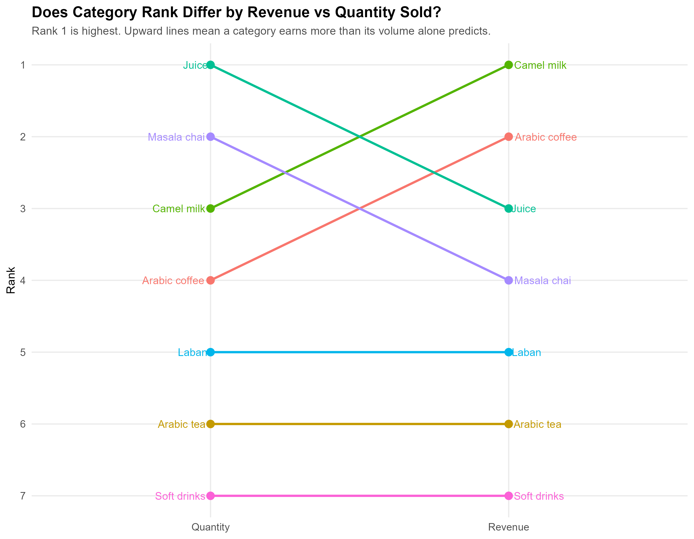
  <p><em>Each category's rank by quantity sold versus its rank by revenue.</em></p>
</div>

This is one of the more important charts in the whole project. Camel milk and Arabic coffee both climb in rank when switching from quantity sold to revenue earned, meaning they earn more than their sales volume alone would predict. Juice and Masala chai show the opposite pattern, high volume but comparatively lower revenue impact. Laban, Arabic tea, and Soft drinks show no rank change at all. Code: [`scripts/02_eda_overview.R`](scripts/02_eda_overview.R), section 7.

### Revenue is flat across geography and channel

<div align="center">
  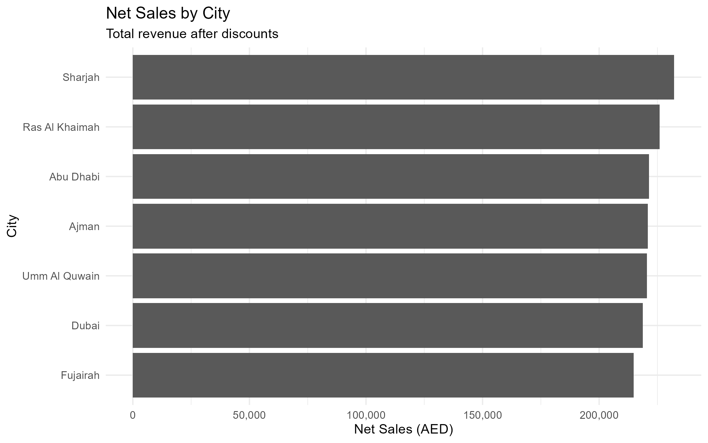
  <p><em>Net sales by city, with the mean marked and the spread called out explicitly.</em></p>
</div>

<div align="center">
  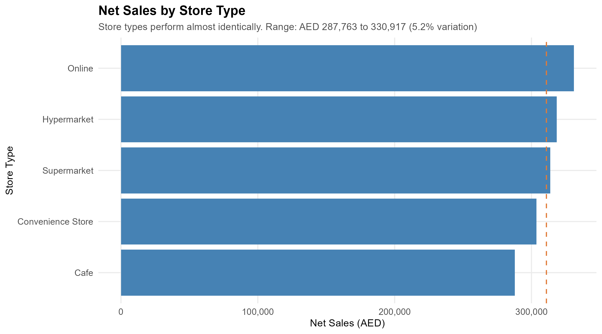
  <p><em>Net sales by store type, showing a similarly narrow spread.</em></p>
</div>

Both City and Store Type show only a few percent of variation from lowest to highest, far too small to represent a meaningful business pattern. Both charts are annotated with the actual range and coefficient of variation rather than implying a ranking that is not really there. Code: [`scripts/02_eda_overview.R`](scripts/02_eda_overview.R), sections 8 and 9.

### How the numeric variables relate to each other

<div align="center">
  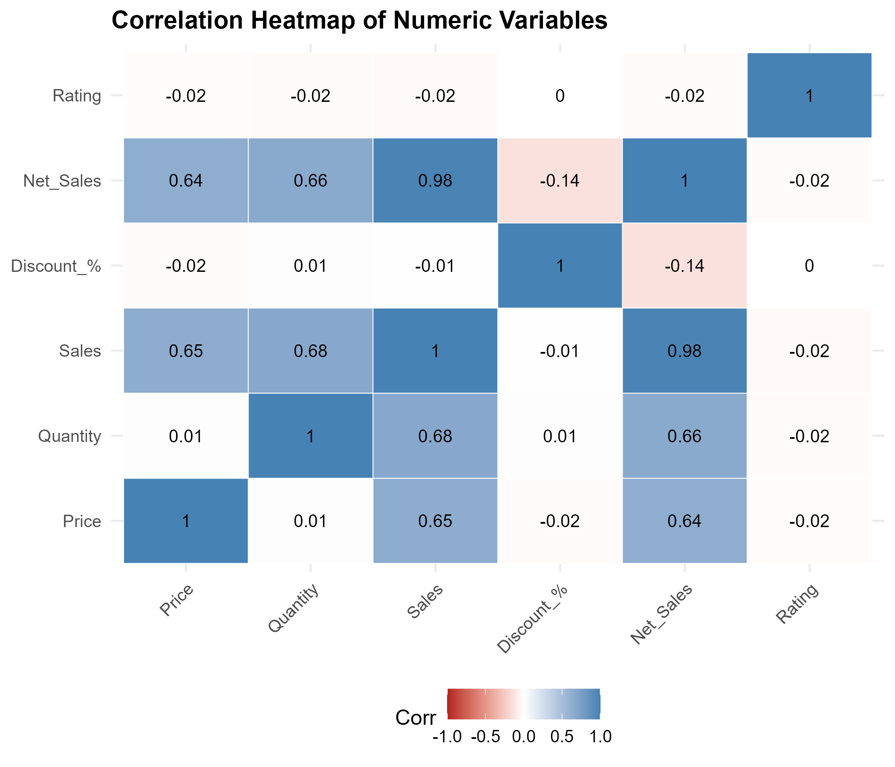
  <p><em>Pairwise Pearson correlation between the numeric variables in the dataset.</em></p>
</div>

Sales and Net Sales are correlated at 0.98, which is expected since one is derived from the other. Price and Quantity both correlate moderately with Sales, which follows directly from Sales being Price multiplied by Quantity. The more notable result is what shows almost no correlation with anything: Discount_% and Rating both sit near zero across the board, consistent with them behaving as noise in this dataset. Code: [`scripts/02_eda_overview.R`](scripts/02_eda_overview.R), section 11.

</br>
<div align="center">
  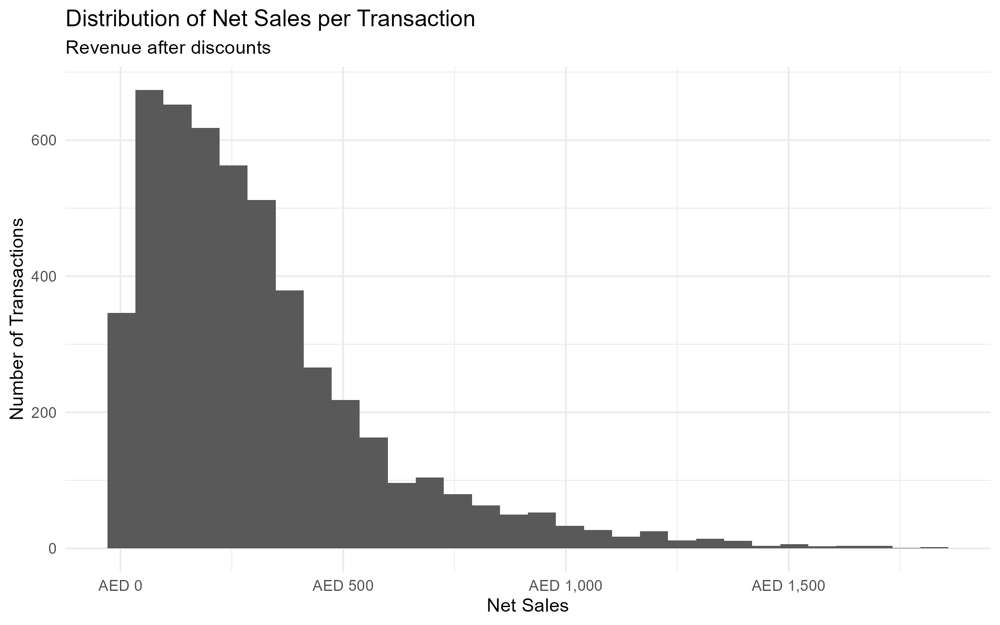
  <p><em>Distribution of net sales per transaction, log scale, with the median marked.</em></p>
</div>

On a log scale, transaction values follow a roughly bell shaped distribution centered around a median of AED 246, rather than the sharply skewed shape it appeared to have on a linear scale.

### Time: stable overall, with one real seasonal signal

<div align="center">
  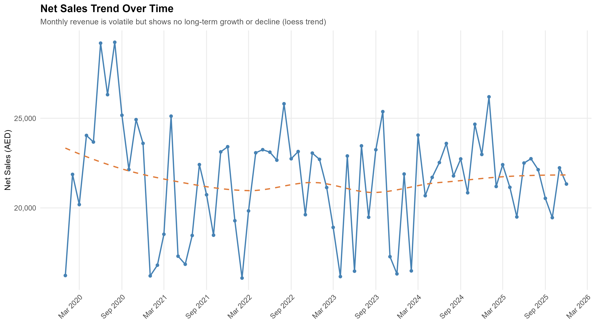
  <p><em>Monthly net sales from 2020 to 2026, with a smoothed loess trend line.</em></p>
</div>

Monthly revenue is volatile month to month but the smoothed trend stays within a narrow band across nearly six years. There is no meaningful long term growth or decline. Code: [`scripts/02_eda_overview.R`](scripts/02_eda_overview.R), section 13.

</br>
<div align="center">
  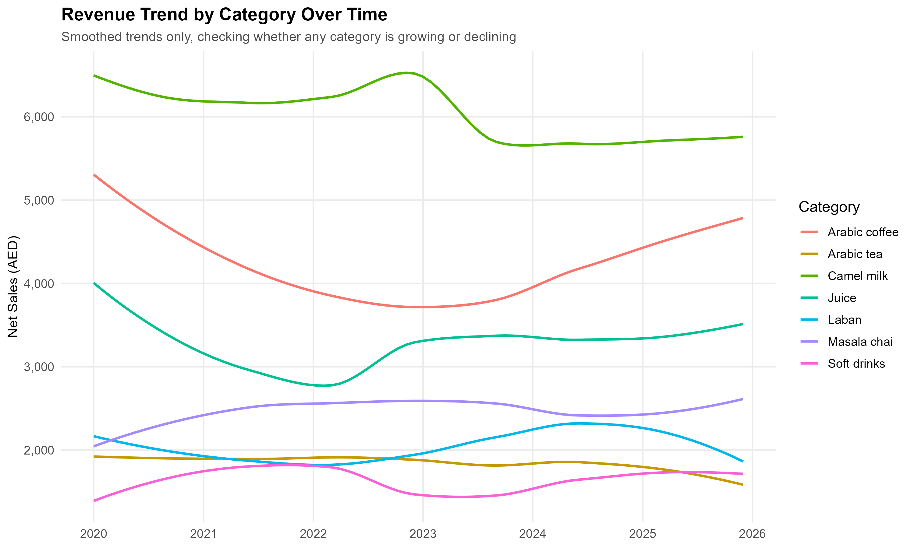
  <p><em>Smoothed revenue trend per category, overlaid on one chart.</em></p>
</div>

Category ranking stays essentially fixed for the entire period. Camel milk leads throughout, followed by Arabic coffee and Juice, with the remaining four categories clustered near the bottom the whole time. The top three categories do show a real dip and recovery cycle around 2021 to 2023, which the pooled chart above smooths away. Code: [`scripts/02_eda_overview.R`](scripts/02_eda_overview.R), section 14.

</br>
<div align="center">
  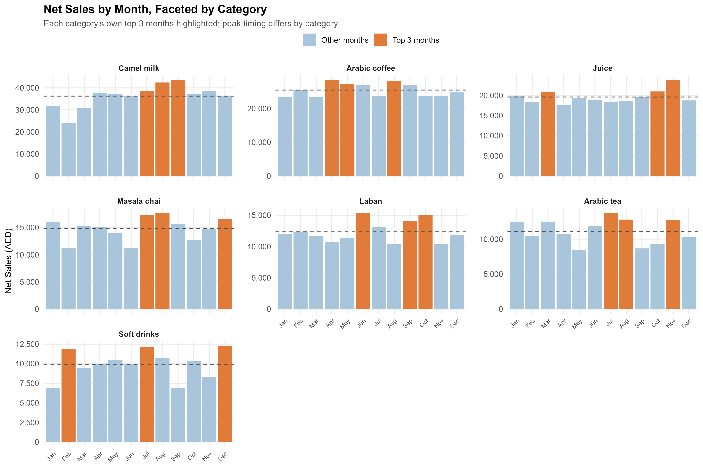
  <p><em>Each category's own top three months of the year, highlighted individually.</em></p>
</div>

Only Camel milk shows a genuine, consecutive seasonal peak, consistently strongest in July through September. Every other category's best months are scattered non consecutively across the year, which points to noise rather than a shared seasonal pattern. Code: [`scripts/02_eda_overview.R`](scripts/02_eda_overview.R), section 15.

### Gender shows no meaningful pattern

<div align="center">
  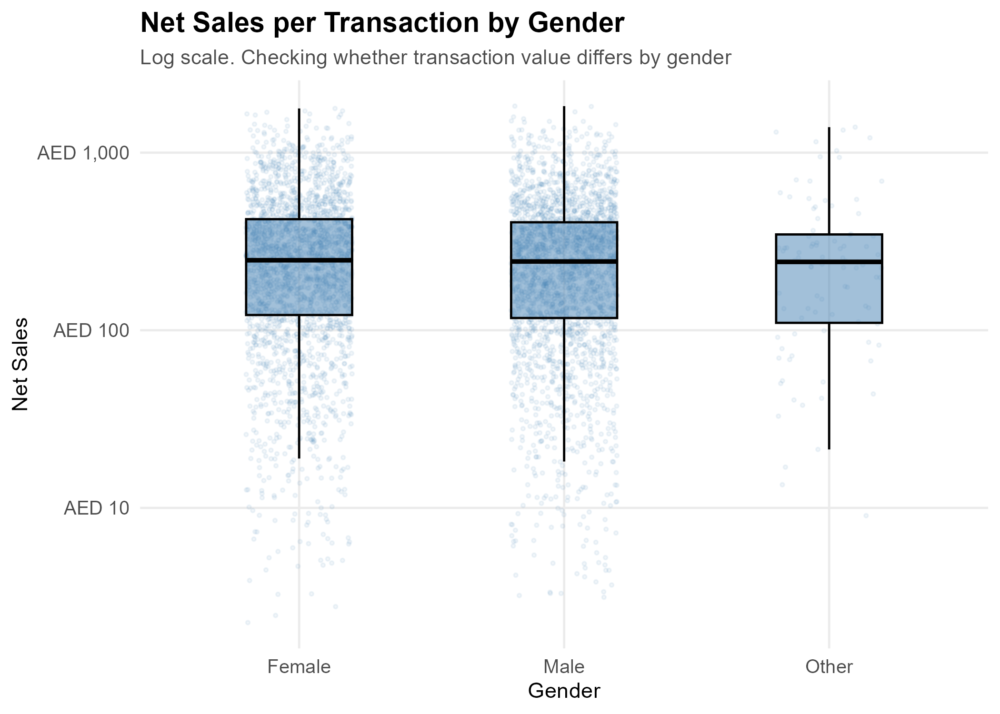
  <p><em>Transaction value by gender, log scale.</em></p>
</div>

Transaction value is nearly identical across Female, Male, and Other. A category preference chart was also tested and dropped, since its only notable feature turned out to be explained by the small sample size of the Other group (91 transactions versus roughly 2,400 to 2,500 each for Female and Male) rather than a real preference. Code: [`scripts/02_eda_overview.R`](scripts/02_eda_overview.R), section 16.

## 🤖 Modeling

### Clustering: testing the premium versus everyday hypothesis

<div align="center">
  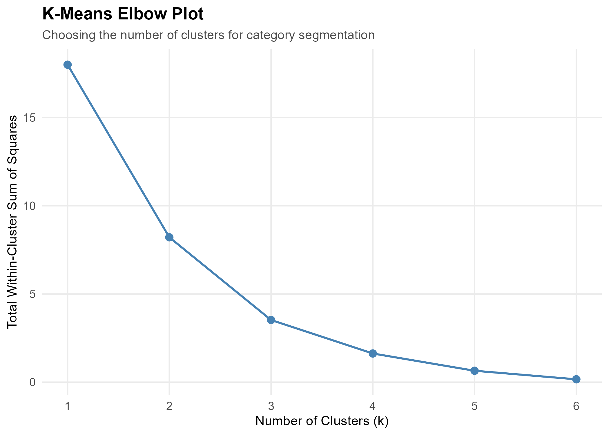
  <p><em>Elbow plot used to choose the number of clusters.</em></p>
</div>

<div align="center">
  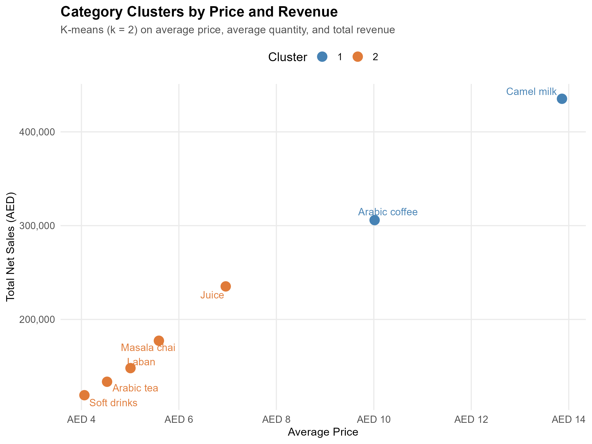
  <p><em>K-means clustering (k = 2) of categories by average price, average quantity, and total revenue.</em></p>
</div>

The elbow plot shows a clean break at k = 2. Running k-means with two clusters splits the seven categories exactly along the line suggested earlier by the price boxplot: Camel milk and Arabic coffee form one cluster, and the remaining five categories form the other. This confirms, using an unsupervised method rather than a visual guess, that a genuine two tier price and revenue structure exists in this dataset. Code: [`scripts/03_modelling.R`](scripts/03_modelling.R), section 2.

### Classification: how well does price alone separate categories?

<div align="center">
  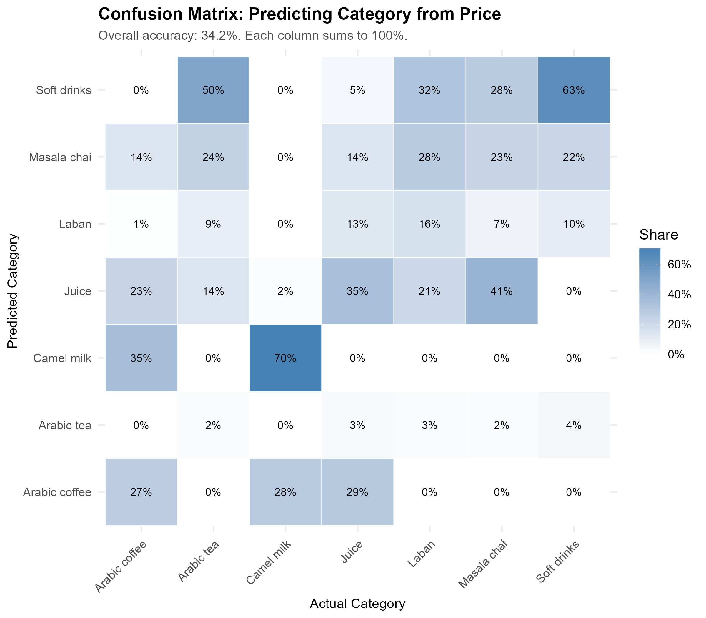
  <p><em>Confusion matrix for a multinomial model predicting category from price alone.</em></p>
</div>

A model using price as the only predictor reaches 34.2% accuracy, well above the roughly 14% expected from random guessing across seven categories. Camel milk is identified correctly 70% of the time, by far the easiest category to separate. The other five categories overlap heavily with each other and are frequently confused, matching what the boxplot showed visually. Code: [`scripts/03_modelling.R`](scripts/03_modelling.R), section 3.

</br>
<div align="center">
  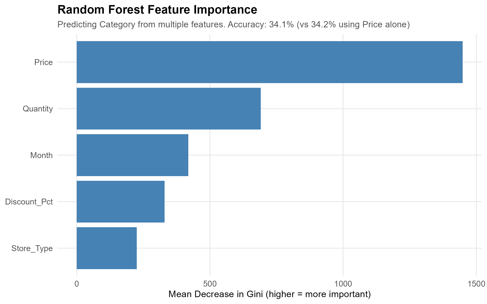
  <p><em>Random forest feature importance for predicting category from multiple variables at once.</em></p>
</div>

Adding Quantity, Discount_%, Store_Type, and Month alongside Price barely changes accuracy at all (34.1% versus 34.2%), and Price remains by far the most important feature in the model. This is the clearest quantitative confirmation in the whole project that price and category carry the real signal in this dataset, while the other variables add very little on top. Code: [`scripts/03_modelling.R`](scripts/03_modelling.R), section 4.

### Forecasting: what does the flat trend imply going forward?

<div align="center">
  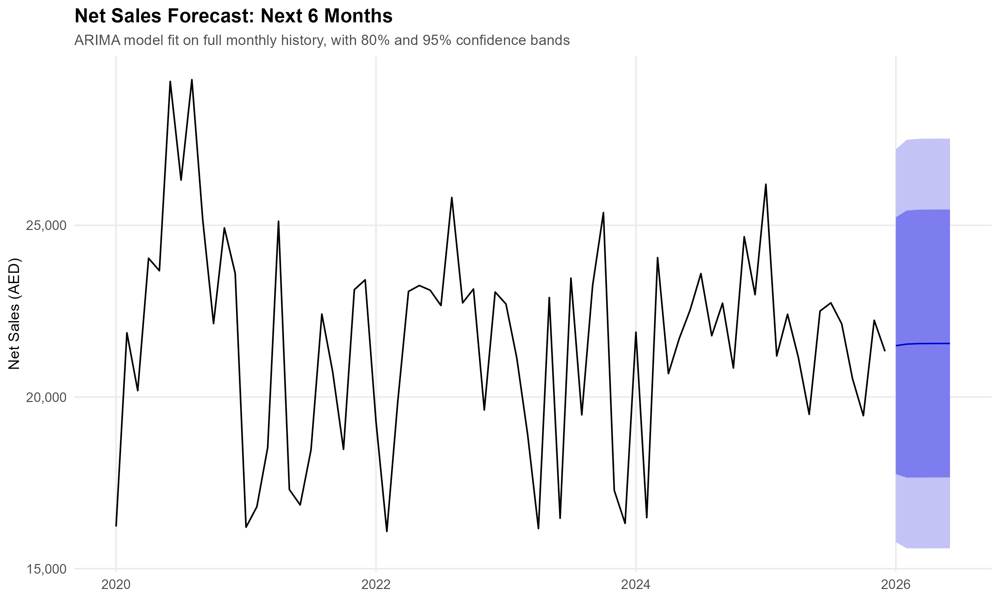
  <p><em>ARIMA forecast for the next six months, with 80% and 95% confidence bands.</em></p>
</div>

An ARIMA model fit on the full monthly history projects revenue to continue hovering around its historical average, consistent with the flat trend found during exploratory analysis. The confidence bands are fairly wide, reflecting the genuine month to month volatility already present in the historical data. Code: [`scripts/03_modelling.R`](scripts/03_modelling.R), section 5.

## 🚨 Anomaly Detection

<div align="center">
  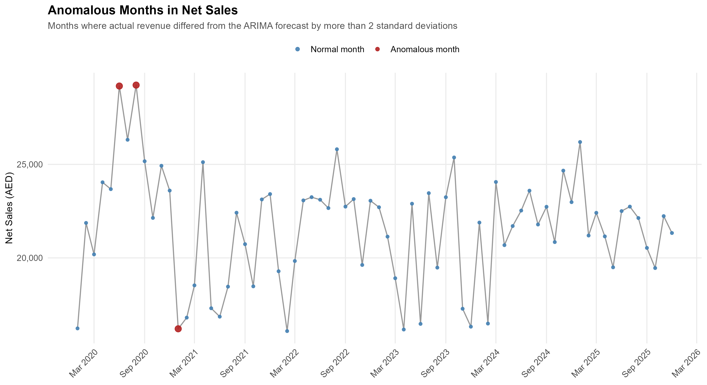
  <p><em>Months where actual revenue differed from the ARIMA model's expectation by more than two standard deviations.</em></p>
</div>

Three months are flagged as anomalous, all within the first year of data (two spikes and one sharp drop). This lines up with the most volatile stretch visible in the monthly trend chart, and likely also reflects the model still calibrating early in the series.

<div align="center">
  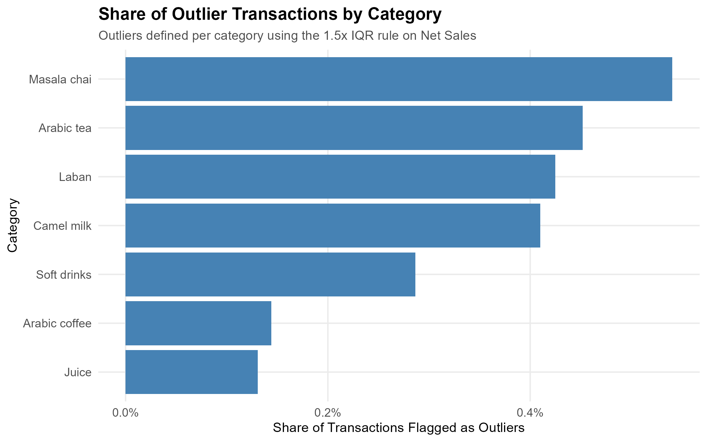
  <p><em>Share of each category's transactions flagged as statistical outliers.</em></p>
</div>

<div align="center">
  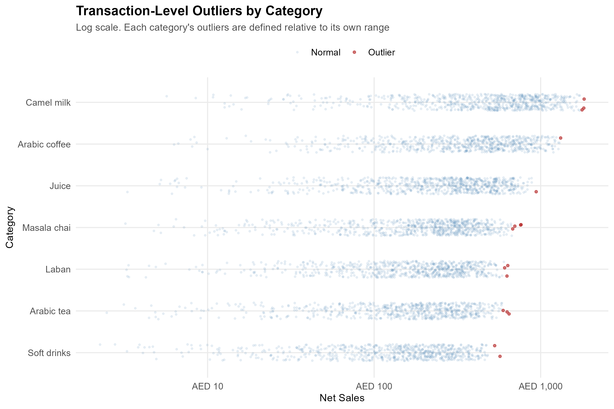
  <p><em>The individual transactions flagged as outliers, shown against each category's normal range.</em></p>
</div>

Fewer than half a percent of transactions in any category are flagged as outliers, using the standard 1.5x interquartile range rule applied within each category's own range. This is a reassuring result for data quality: the outliers that do exist sit right at the tail of each category's normal distribution, exactly where genuine unusually large transactions would be expected, rather than being scattered randomly across the data. Code: [`scripts/04_anomaly_detection.R`](scripts/04_anomaly_detection.R).

## 🧵 Summary

Across every method used in this project, exploratory charts, correlation analysis, clustering, classification, and feature importance, the same story holds. Category and Price are what actually differentiate this business. Camel milk and Arabic coffee form a distinct, higher priced tier that earns disproportionately more revenue than its sales volume would suggest. Everything else (City, Store_Type, Discount_%, Rating, Quantity, Gender) behaves close to flat or random. The one real exception to the flatness is time: Camel milk carries a genuine, consistent summer seasonal peak, and the top three categories show a shared multi year dip and recovery pattern that a purely aggregate view would have missed.

## ⚖️ License

See [LICENSE](LICENSE) for details.